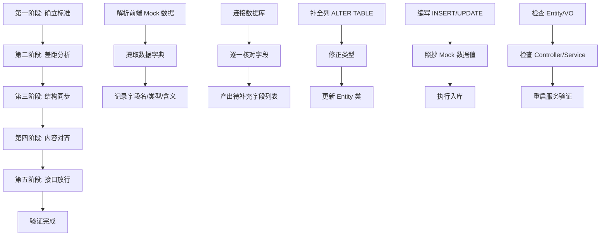

# Design Document: Data Alignment SOP

## Overview

本设计文档描述了前后端数据对齐标准作业程序（SOP）的技术实现方案。该方案旨在系统性地解决前端 Mock 数据与后端数据库之间的数据结构和内容不一致问题，确保前端页面能够正确显示真实数据。

### 核心流程



## Architecture

### 系统架构

```
┌─────────────────────────────────────────────────────────────────┐
│                        前端 (Vue + TypeScript)                    │
│  ┌─────────────────┐  ┌─────────────────┐  ┌─────────────────┐  │
│  │  Mock Data      │  │  TypeScript     │  │  Vue Components │  │
│  │  indicators2026 │  │  Types/index.ts │  │  Views          │  │
│  └────────┬────────┘  └────────┬────────┘  └────────┬────────┘  │
└───────────┼────────────────────┼────────────────────┼───────────┘
            │                    │                    │
            ▼                    ▼                    ▼
┌─────────────────────────────────────────────────────────────────┐
│                        数据对齐层                                 │
│  ┌─────────────────┐  ┌─────────────────┐  ┌─────────────────┐  │
│  │  数据字典提取    │  │  差距分析器     │  │  SQL 生成器     │  │
│  └─────────────────┘  └─────────────────┘  └─────────────────┘  │
└─────────────────────────────────────────────────────────────────┘
            │                    │                    │
            ▼                    ▼                    ▼
┌─────────────────────────────────────────────────────────────────┐
│                        后端 (Spring Boot + JPA)                   │
│  ┌─────────────────┐  ┌─────────────────┐  ┌─────────────────┐  │
│  │  Entity Classes │  │  VO Classes     │  │  Controllers    │  │
│  │  Indicator.java │  │  IndicatorVO    │  │  Services       │  │
│  └────────┬────────┘  └────────┬────────┘  └────────┬────────┘  │
└───────────┼────────────────────┼────────────────────┼───────────┘
            │                    │                    │
            ▼                    ▼                    ▼
┌─────────────────────────────────────────────────────────────────┐
│                        数据库 (PostgreSQL)                        │
│  ┌─────────────────┐  ┌─────────────────┐  ┌─────────────────┐  │
│  │  indicator      │  │  milestone      │  │  org            │  │
│  │  strategic_task │  │  progress_report│  │  app_user       │  │
│  └─────────────────┘  └─────────────────┘  └─────────────────┘  │
└─────────────────────────────────────────────────────────────────┘
```

## Components and Interfaces

### 1. 前端数据结构 (TypeScript)

```typescript
// 核心指标接口 - 来自 strategic-task-management/src/types/index.ts
interface StrategicIndicator {
  id: string
  name: string
  isQualitative: boolean
  type1: '定性' | '定量'
  type2: '发展性' | '基础性'
  progress: number
  createTime: string
  weight: number
  remark: string
  canWithdraw: boolean
  milestones: Milestone[]
  targetValue: number
  actualValue?: number
  unit: string
  responsibleDept: string
  responsiblePerson: string
  status: 'draft' | 'active' | 'archived' | 'distributed' | 'pending' | 'approved'
  isStrategic: boolean
  taskContent?: string
  ownerDept?: string
  parentIndicatorId?: string
  year?: number
  statusAudit?: StatusAuditEntry[]
  progressApprovalStatus?: ProgressApprovalStatus
  pendingProgress?: number
  pendingRemark?: string
  pendingAttachments?: string[]
}
```

### 2. 后端数据结构 (Java Entity)

```java
// 当前 Indicator Entity - 来自 sism-backend
@Entity
@Table(name = "indicator")
public class Indicator extends BaseEntity {
    private Long indicatorId;
    private StrategicTask task;
    private Indicator parentIndicator;
    private IndicatorLevel level;
    private Org ownerOrg;
    private Org targetOrg;
    private String indicatorDesc;
    private BigDecimal weightPercent;
    private Integer sortOrder;
    private Integer year;
    private IndicatorStatus status;
    private String remark;
    private List<Milestone> milestones;
}
```

### 3. 字段映射关系

| 前端字段 (TypeScript) | 后端字段 (Java) | 数据库列 | 状态 |
|----------------------|-----------------|----------|------|
| id | indicatorId | indicator_id | ✅ |
| name | indicatorDesc | indicator_desc | ✅ |
| isQualitative | - | is_qualitative | ❌ 缺失 |
| type1 | - | type1 | ❌ 缺失 |
| type2 | - | type2 | ❌ 缺失 |
| progress | - | progress | ❌ 缺失 (需从 ProgressReport 计算) |
| createTime | createdAt | created_at | ✅ |
| weight | weightPercent | weight_percent | ✅ |
| remark | remark | remark | ✅ |
| canWithdraw | - | can_withdraw | ❌ 缺失 |
| targetValue | - | target_value | ❌ 缺失 |
| unit | - | unit | ❌ 缺失 |
| responsibleDept | targetOrg.name | target_org_id | ✅ |
| responsiblePerson | - | responsible_person | ❌ 缺失 |
| status | status | status | ✅ |
| isStrategic | level | level | ⚠️ 需转换 |
| ownerDept | ownerOrg.name | owner_org_id | ✅ |
| parentIndicatorId | parentIndicator.id | parent_indicator_id | ✅ |
| year | year | year | ✅ |
| statusAudit | - | status_audit | ❌ 缺失 (JSON) |
| progressApprovalStatus | - | progress_approval_status | ❌ 缺失 |
| pendingProgress | - | pending_progress | ❌ 缺失 |
| pendingRemark | - | pending_remark | ❌ 缺失 |

## Data Models

### 待补充的数据库字段

```sql
-- 指标表需要补充的字段
ALTER TABLE indicator ADD COLUMN is_qualitative BOOLEAN DEFAULT FALSE;
ALTER TABLE indicator ADD COLUMN type1 VARCHAR(20); -- '定性' | '定量'
ALTER TABLE indicator ADD COLUMN type2 VARCHAR(20); -- '发展性' | '基础性'
ALTER TABLE indicator ADD COLUMN can_withdraw BOOLEAN DEFAULT FALSE;
ALTER TABLE indicator ADD COLUMN target_value DECIMAL(10,2);
ALTER TABLE indicator ADD COLUMN unit VARCHAR(50);
ALTER TABLE indicator ADD COLUMN responsible_person VARCHAR(100);
ALTER TABLE indicator ADD COLUMN status_audit JSONB DEFAULT '[]';
ALTER TABLE indicator ADD COLUMN progress_approval_status VARCHAR(20) DEFAULT 'none';
ALTER TABLE indicator ADD COLUMN pending_progress INTEGER;
ALTER TABLE indicator ADD COLUMN pending_remark TEXT;
ALTER TABLE indicator ADD COLUMN pending_attachments JSONB DEFAULT '[]';
```

### 种子数据要求

根据前端 Mock 数据 `indicators2026.ts`，数据库需要包含：

1. **定量指标** (至少 12 条)
   - 就业率相关指标
   - 课程优良率指标
   - 创业比例指标

2. **定性指标** (自定义里程碑)
   - 校友工作机制建设
   - 信息化数据报送

3. **指标层级关系**
   - 战略级指标 (isStrategic: true)
   - 二级学院指标 (parentIndicatorId 关联)


## Correctness Properties

*A property is a characteristic or behavior that should hold true across all valid executions of a system-essentially, a formal statement about what the system should do. Properties serve as the bridge between human-readable specifications and machine-verifiable correctness guarantees.*

### Property 1: 字段提取完整性
*For any* TypeScript interface definition, parsing and extracting field names SHALL produce a complete list containing all declared fields with no omissions.
**Validates: Requirements 1.1, 1.2**

### Property 2: 数据字典序列化往返
*For any* valid data dictionary object, serializing to JSON/Markdown and parsing back SHALL produce an equivalent object.
**Validates: Requirements 1.4**

### Property 3: 差距分类正确性
*For any* pair of field sets (frontend, database), the gap analysis SHALL correctly classify each field as present, missing, or inconsistent with no misclassifications.
**Validates: Requirements 2.1, 2.2, 2.3**

### Property 4: 差距报告完整性
*For any* gap analysis result, the generated report SHALL contain all identified discrepancies with none omitted.
**Validates: Requirements 2.4**

### Property 5: SQL 生成正确性
*For any* missing field specification, the generated ALTER TABLE statement SHALL be syntactically valid and semantically correct for the target database.
**Validates: Requirements 3.1, 3.2**

### Property 6: 种子数据值保真
*For any* field in the frontend mock data, the corresponding database seed data SHALL contain the exact same value (not placeholder values).
**Validates: Requirements 4.1, 4.2**

### Property 7: Entity 字段覆盖
*For any* database column added during schema sync, the backend Entity class SHALL contain a corresponding Java property.
**Validates: Requirements 5.1**

### Property 8: VO 字段覆盖
*For any* field in the frontend TypeScript interface, the backend VO class SHALL contain a corresponding property with compatible type.
**Validates: Requirements 5.2**

### Property 9: API 响应字段匹配
*For any* API endpoint returning indicator data, the response JSON field names SHALL match the frontend TypeScript interface field names (camelCase).
**Validates: Requirements 5.3**

### Property 10: 序列化往返一致性
*For any* valid indicator object, serializing to JSON and deserializing back SHALL produce an equivalent object.
**Validates: Requirements 6.1**

### Property 11: Mock 与 API 数据一致性
*For any* indicator ID present in both mock data and database, the API response values SHALL match the mock data values exactly.
**Validates: Requirements 6.2, 6.3**

### Property 12: 指标类型过滤正确性
*For any* filter criteria (定性/定量, 发展性/基础性), the filtered result SHALL contain only indicators matching the criteria.
**Validates: Requirements 7.3, 7.5**

### Property 13: 里程碑数据完整性
*For any* indicator with milestones, the milestone list SHALL contain all required fields (id, name, targetProgress, deadline, status).
**Validates: Requirements 7.4**

## Error Handling

### 数据库连接错误
- 使用连接池管理数据库连接
- 实现重试机制（最多 3 次）
- 记录详细错误日志但不暴露敏感信息

### 数据类型不匹配
- 在数据插入前进行类型验证
- 提供明确的类型转换规则
- 记录类型转换警告

### 外键约束违反
- 按正确顺序插入数据（先父表后子表）
- 验证引用完整性
- 提供清晰的错误消息

### Schema 变更失败
- 使用事务包装 DDL 操作
- 提供回滚机制
- 备份现有数据

## Testing Strategy

### 单元测试
- 测试字段提取逻辑
- 测试差距分析算法
- 测试 SQL 生成器
- 测试类型转换函数

### 属性测试 (Property-Based Testing)

使用 **jqwik** (Java) 和 **fast-check** (TypeScript) 进行属性测试。

**测试配置：**
- 每个属性测试运行至少 100 次迭代
- 使用智能生成器约束输入空间

**属性测试标注格式：**
```java
// **Feature: data-alignment-sop, Property 1: 字段提取完整性**
@Property(tries = 100)
void fieldExtractionCompleteness(@ForAll TypeScriptInterface input) {
    // ...
}
```

### 集成测试
- 测试完整的数据对齐流程
- 验证前后端数据一致性
- 测试 API 响应格式

### 验证检查清单

| 检查项 | 验证方法 |
|--------|----------|
| 数据库包含至少 12 条定量指标 | SQL COUNT 查询 |
| 定性指标有自定义里程碑 | 检查 milestone 表关联 |
| 所有前端字段在 API 响应中存在 | JSON Schema 验证 |
| 字段值与 Mock 数据一致 | 逐字段比对 |
| 外键关系正确 | 数据库约束检查 |
