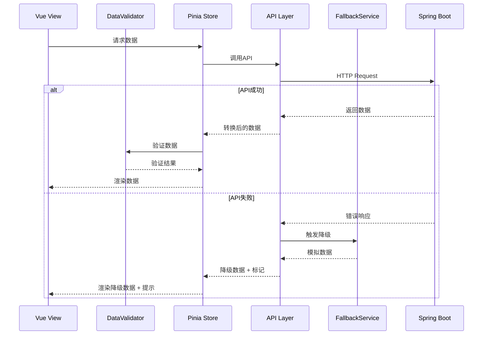

# Design Document: Page Data Verification

## Overview

本设计文档描述了SISM战略指标管理系统页面数据检查与修复功能的技术实现方案。该功能旨在系统性地验证各页面数据是否正确从数据库获取，识别数据缺失、格式异常、API调用失败等问题，并提供修复方案。

### 设计目标

1. **数据完整性验证** - 确保所有页面数据来源于API而非硬编码
2. **数据格式校验** - 验证数据字段格式符合预期
3. **空值处理** - 优雅处理null/undefined/空数组情况
4. **错误恢复** - 提供降级机制和友好错误提示
5. **可追溯性** - 记录数据来源和验证结果

## Architecture

### 整体架构

```
┌─────────────────────────────────────────────────────────────────┐
│                        Vue 3 Views Layer                         │
│  ┌──────────┐ ┌──────────┐ ┌──────────┐ ┌──────────┐           │
│  │Dashboard │ │Indicator │ │Strategic │ │ Profile  │  ...      │
│  │  View    │ │ListView  │ │TaskView  │ │  View    │           │
│  └────┬─────┘ └────┬─────┘ └────┬─────┘ └────┬─────┘           │
│       │            │            │            │                   │
│       └────────────┴────────────┴────────────┘                   │
│                          │                                       │
│  ┌───────────────────────▼───────────────────────────────────┐  │
│  │                  Data Validation Layer                     │  │
│  │  ┌─────────────┐ ┌─────────────┐ ┌─────────────────────┐  │  │
│  │  │DataValidator│ │LoadingState │ │  ErrorHandler       │  │  │
│  │  │  Composable │ │  Composable │ │  Composable         │  │  │
│  │  └─────────────┘ └─────────────┘ └─────────────────────┘  │  │
│  └───────────────────────┬───────────────────────────────────┘  │
└──────────────────────────┼──────────────────────────────────────┘
                           │
┌──────────────────────────▼──────────────────────────────────────┐
│                      Pinia Store Layer                           │
│  ┌──────────┐ ┌──────────┐ ┌──────────┐ ┌──────────┐           │
│  │strategic │ │dashboard │ │   org    │ │   auth   │           │
│  │  Store   │ │  Store   │ │  Store   │ │  Store   │           │
│  └────┬─────┘ └────┬─────┘ └────┬─────┘ └────┬─────┘           │
│       └────────────┴────────────┴────────────┘                   │
│                          │                                       │
└──────────────────────────┼──────────────────────────────────────┘
                           │
┌──────────────────────────▼──────────────────────────────────────┐
│                        API Layer                                 │
│  ┌──────────┐ ┌──────────┐ ┌──────────┐ ┌──────────┐           │
│  │strategic │ │indicator │ │   org    │ │ fallback │           │
│  │   API    │ │   API    │ │   API    │ │ Service  │           │
│  └────┬─────┘ └────┬─────┘ └────┬─────┘ └────┬─────┘           │
│       └────────────┴────────────┴────────────┘                   │
│                          │                                       │
└──────────────────────────┼──────────────────────────────────────┘
                           │
┌──────────────────────────▼──────────────────────────────────────┐
│                    Spring Boot Backend                           │
│  ┌──────────────────────────────────────────────────────────┐   │
│  │                   REST API Controllers                    │   │
│  └──────────────────────────────────────────────────────────┘   │
│                          │                                       │
│  ┌──────────────────────────────────────────────────────────┐   │
│  │                   PostgreSQL Database                     │   │
│  └──────────────────────────────────────────────────────────┘   │
└─────────────────────────────────────────────────────────────────┘
```

### 数据流



## Components and Interfaces

### 1. DataValidator Composable

数据验证组合式函数，提供统一的数据验证能力。

```typescript
// src/composables/useDataValidator.ts

interface ValidationResult {
  isValid: boolean
  errors: ValidationError[]
  warnings: ValidationWarning[]
}

interface ValidationError {
  field: string
  message: string
  value: unknown
}

interface ValidationWarning {
  field: string
  message: string
  suggestion: string
}

interface DataValidatorOptions {
  strict?: boolean           // 严格模式，空值视为错误
  logErrors?: boolean        // 是否记录错误日志
  defaultValues?: Record<string, unknown>  // 默认值映射
}

export function useDataValidator(options?: DataValidatorOptions) {
  // 验证指标数据完整性
  function validateIndicator(indicator: unknown): ValidationResult
  
  // 验证里程碑数据
  function validateMilestone(milestone: unknown): ValidationResult
  
  // 验证用户数据
  function validateUser(user: unknown): ValidationResult
  
  // 验证日期格式
  function validateDateFormat(date: unknown): boolean
  
  // 验证进度值范围
  function validateProgress(progress: unknown): boolean
  
  // 验证枚举值
  function validateEnum<T>(value: unknown, validValues: T[]): boolean
  
  // 安全获取字段值，提供默认值
  function safeGet<T>(obj: unknown, path: string, defaultValue: T): T
  
  // 批量验证数组数据
  function validateArray<T>(
    items: unknown[], 
    validator: (item: unknown) => ValidationResult
  ): ValidationResult[]
}
```

### 2. LoadingState Composable

加载状态管理组合式函数。

```typescript
// src/composables/useLoadingState.ts

interface LoadingStateOptions {
  timeout?: number           // 超时时间(ms)
  retryCount?: number        // 重试次数
  showSkeleton?: boolean     // 是否显示骨架屏
}

export function useLoadingState(options?: LoadingStateOptions) {
  const isLoading: Ref<boolean>
  const hasError: Ref<boolean>
  const errorMessage: Ref<string>
  const isTimeout: Ref<boolean>
  const retryAttempts: Ref<number>
  
  // 开始加载
  function startLoading(): void
  
  // 结束加载
  function endLoading(): void
  
  // 设置错误
  function setError(message: string): void
  
  // 清除错误
  function clearError(): void
  
  // 重试操作
  async function retry<T>(operation: () => Promise<T>): Promise<T>
  
  // 带超时的操作
  async function withTimeout<T>(
    operation: () => Promise<T>, 
    timeout?: number
  ): Promise<T>
}
```

### 3. ErrorHandler Composable

错误处理组合式函数。

```typescript
// src/composables/useErrorHandler.ts

interface ErrorInfo {
  code: string
  message: string
  details?: unknown
  timestamp: Date
  requestId?: string
}

interface ErrorHandlerOptions {
  showNotification?: boolean  // 是否显示通知
  logToConsole?: boolean      // 是否记录到控制台
  reportToServer?: boolean    // 是否上报服务器
}

export function useErrorHandler(options?: ErrorHandlerOptions) {
  const lastError: Ref<ErrorInfo | null>
  const errorHistory: Ref<ErrorInfo[]>
  
  // 处理API错误
  function handleApiError(error: unknown): ErrorInfo
  
  // 处理验证错误
  function handleValidationError(errors: ValidationError[]): void
  
  // 显示友好错误提示
  function showErrorMessage(message: string, type?: 'error' | 'warning'): void
  
  // 记录错误日志
  function logError(error: ErrorInfo): void
  
  // 获取用户友好的错误消息
  function getFriendlyMessage(error: unknown): string
  
  // 判断是否可重试
  function isRetryable(error: unknown): boolean
}
```

### 4. PageDataChecker Service

页面数据检查服务，用于系统性验证页面数据。

```typescript
// src/services/pageDataChecker.ts

interface PageCheckResult {
  pageName: string
  timestamp: Date
  dataSource: 'api' | 'fallback' | 'hardcoded' | 'unknown'
  validationResults: ValidationResult[]
  issues: DataIssue[]
  suggestions: string[]
}

interface DataIssue {
  severity: 'error' | 'warning' | 'info'
  category: 'missing' | 'format' | 'empty' | 'inconsistent'
  field: string
  description: string
  currentValue: unknown
  expectedValue?: unknown
}

export class PageDataChecker {
  // 检查Dashboard页面数据
  checkDashboardData(store: DashboardStore): PageCheckResult
  
  // 检查指标列表页面数据
  checkIndicatorListData(store: StrategicStore): PageCheckResult
  
  // 检查指标下发页面数据
  checkIndicatorDistributionData(
    strategicStore: StrategicStore, 
    orgStore: OrgStore
  ): PageCheckResult
  
  // 检查战略任务页面数据
  checkStrategicTaskData(store: StrategicStore): PageCheckResult
  
  // 检查个人信息页面数据
  checkProfileData(store: AuthStore): PageCheckResult
  
  // 检查消息中心页面数据
  checkMessageCenterData(store: StrategicStore): PageCheckResult
  
  // 生成检查报告
  generateReport(results: PageCheckResult[]): CheckReport
  
  // 验证数据来源是否为API
  verifyDataSource(store: unknown): 'api' | 'fallback' | 'hardcoded'
}
```

### 5. Store Enhancement

增强现有Store以支持数据验证。

```typescript
// src/stores/strategic.ts 增强

export const useStrategicStore = defineStore('strategic', () => {
  // 新增：数据来源标记
  const dataSource = ref<'api' | 'fallback' | 'local'>('local')
  
  // 新增：数据加载状态
  const loadingState = ref({
    indicators: false,
    tasks: false,
    error: null as string | null
  })
  
  // 新增：数据验证状态
  const validationState = ref({
    lastValidated: null as Date | null,
    isValid: true,
    issues: [] as DataIssue[]
  })
  
  // 新增：从API加载数据
  async function loadFromApi(year?: number): Promise<void>
  
  // 新增：验证当前数据
  function validateCurrentData(): ValidationResult
  
  // 新增：获取数据健康状态
  function getDataHealth(): DataHealthStatus
})
```

## Data Models

### 验证规则配置

```typescript
// src/config/validationRules.ts

export const indicatorValidationRules = {
  id: { required: true, type: 'string' },
  name: { required: true, type: 'string', minLength: 1 },
  progress: { required: true, type: 'number', min: 0, max: 100 },
  weight: { required: true, type: 'number', min: 0 },
  responsibleDept: { required: true, type: 'string' },
  year: { required: true, type: 'number', min: 2020, max: 2030 },
  milestones: { required: false, type: 'array' },
  progressApprovalStatus: { 
    required: false, 
    type: 'enum', 
    values: ['none', 'draft', 'pending', 'approved', 'rejected'] 
  }
}

export const milestoneValidationRules = {
  id: { required: true, type: 'string' },
  name: { required: true, type: 'string' },
  targetProgress: { required: true, type: 'number', min: 0, max: 100 },
  deadline: { required: true, type: 'date' },
  status: { 
    required: true, 
    type: 'enum', 
    values: ['pending', 'completed', 'overdue'] 
  }
}

export const userValidationRules = {
  id: { required: true, type: 'string' },
  name: { required: true, type: 'string' },
  role: { 
    required: true, 
    type: 'enum', 
    values: ['strategic_dept', 'functional_dept', 'secondary_college'] 
  },
  department: { required: true, type: 'string' }
}
```

### 检查报告数据模型

```typescript
// src/types/checkReport.ts

export interface CheckReport {
  generatedAt: Date
  totalPages: number
  pagesChecked: number
  overallHealth: 'healthy' | 'warning' | 'critical'
  summary: {
    totalIssues: number
    errors: number
    warnings: number
    infos: number
  }
  pageResults: PageCheckResult[]
  recommendations: Recommendation[]
}

export interface Recommendation {
  priority: 'high' | 'medium' | 'low'
  category: string
  description: string
  affectedPages: string[]
  suggestedFix: string
}
```


## Correctness Properties

*A property is a characteristic or behavior that should hold true across all valid executions of a system—essentially, a formal statement about what the system should do. Properties serve as the bridge between human-readable specifications and machine-verifiable correctness guarantees.*

### Property 1: Data Source Verification

*For any* page data displayed in the application, if the data originates from a Pinia Store, then the Store's dataSource flag SHALL indicate 'api' when backend is available, and the data SHALL match the structure returned by the corresponding API endpoint.

**Validates: Requirements 1.1, 2.1, 4.1, 5.1, 6.1, 7.1, 8.1**

### Property 2: Filter Logic Correctness

*For any* list of indicators and any filter criteria (year, department, status), applying the filter SHALL return exactly those indicators where all specified filter conditions match, and the result set SHALL be a subset of the original list.

**Validates: Requirements 2.2, 2.3, 3.3, 4.2, 8.2**

### Property 3: Data Completeness Validation

*For any* indicator object, milestone object, or audit log entry, the validation function SHALL return isValid=true if and only if all required fields (as defined in validationRules) are present and non-null.

**Validates: Requirements 2.4, 3.4, 4.4**

### Property 4: Enum Value Validation

*For any* field defined as an enum type (role, progressApprovalStatus, milestoneStatus), the validation function SHALL return true if and only if the value is one of the predefined valid enum values.

**Validates: Requirements 2.6, 5.2**

### Property 5: Data Format Validation

*For any* date field, the formatted output SHALL match the pattern "YYYY年MM月DD日" or "YYYY-MM-DD". *For any* progress value, it SHALL be a number in the range [0, 100]. *For any* weight value, it SHALL be a non-negative number.

**Validates: Requirements 9.1, 9.2, 9.3**

### Property 6: Null Value Handling

*For any* field value that is null, undefined, or an empty array, the safeGet function SHALL return the specified default value, and the UI SHALL display a placeholder or empty state message rather than throwing an error or showing blank content.

**Validates: Requirements 1.6, 3.5, 4.5, 5.4, 9.4, 9.5**

### Property 7: Fallback Mechanism Trigger

*For any* API call that fails (network error, timeout, or server error), the fallback service SHALL be triggered, and the returned data SHALL have a fallback indicator set to true, and a fallback reason SHALL be logged.

**Validates: Requirements 1.4, 7.4, 7.5**

### Property 8: VO to Frontend Type Conversion

*For any* IndicatorVO returned by the API, converting it to StrategicIndicator and back (round-trip) SHALL preserve all essential field values (id, name, progress, weight, responsibleDept, year).

**Validates: Requirements 7.3**

### Property 9: Milestone Date Judgment

*For any* milestone with a deadline, if the current date is past the deadline and status is not 'completed', then getOverdueMilestones SHALL include this milestone. If the deadline is within 30 days from now and status is 'pending', then getUpcomingMilestones SHALL include this milestone.

**Validates: Requirements 6.2, 6.3**

### Property 10: Parent-Child Indicator Association

*For any* child indicator with a parentIndicatorId, there SHALL exist a parent indicator with matching id in the indicators list, and the child's taskContent SHALL match the parent's taskContent.

**Validates: Requirements 3.2**

## Error Handling

### API Error Handling Strategy

```typescript
// 错误分类和处理策略
const errorHandlingStrategy = {
  // 网络错误 - 触发降级
  NETWORK_ERROR: {
    action: 'fallback',
    userMessage: '网络连接失败，正在使用离线数据',
    retryable: true
  },
  
  // 超时错误 - 提示重试
  TIMEOUT_ERROR: {
    action: 'retry',
    userMessage: '请求超时，请稍后重试',
    retryable: true,
    maxRetries: 3
  },
  
  // 认证错误 - 跳转登录
  AUTH_ERROR: {
    action: 'redirect',
    userMessage: '登录已过期，请重新登录',
    retryable: false
  },
  
  // 服务器错误 - 触发降级
  SERVER_ERROR: {
    action: 'fallback',
    userMessage: '服务器繁忙，正在使用缓存数据',
    retryable: true
  },
  
  // 数据验证错误 - 显示详情
  VALIDATION_ERROR: {
    action: 'display',
    userMessage: '数据格式异常，请联系管理员',
    retryable: false
  }
}
```

### 降级数据策略

```typescript
// 降级数据优先级
const fallbackPriority = [
  'localStorage',    // 1. 本地存储的最近数据
  'sessionStorage',  // 2. 会话存储的数据
  'mockData',        // 3. 预定义的模拟数据
  'emptyState'       // 4. 空状态（最后手段）
]
```

## Testing Strategy

### 单元测试

使用 Vitest 进行单元测试，覆盖以下场景：

1. **DataValidator 测试**
   - 验证各类型字段的验证逻辑
   - 测试边界值（0, 100, null, undefined）
   - 测试枚举值验证

2. **LoadingState 测试**
   - 测试状态转换
   - 测试超时处理
   - 测试重试逻辑

3. **ErrorHandler 测试**
   - 测试各类错误的处理
   - 测试友好消息生成
   - 测试日志记录

### 属性测试

使用 fast-check 进行属性测试，每个属性测试运行至少100次迭代：

```typescript
// 示例：过滤逻辑正确性属性测试
// Feature: page-data-verification, Property 2: Filter Logic Correctness
describe('Filter Logic Correctness', () => {
  it('should return subset matching all filter criteria', () => {
    fc.assert(
      fc.property(
        fc.array(arbitraryIndicator()),
        fc.record({
          year: fc.option(fc.integer({ min: 2020, max: 2030 })),
          department: fc.option(fc.string()),
          status: fc.option(fc.constantFrom('pending', 'approved', 'rejected'))
        }),
        (indicators, filters) => {
          const result = filterIndicators(indicators, filters)
          
          // 结果是原列表的子集
          expect(result.every(r => indicators.includes(r))).toBe(true)
          
          // 结果中每个元素都满足所有过滤条件
          result.forEach(indicator => {
            if (filters.year) expect(indicator.year).toBe(filters.year)
            if (filters.department) expect(indicator.responsibleDept).toBe(filters.department)
            if (filters.status) expect(indicator.progressApprovalStatus).toBe(filters.status)
          })
        }
      ),
      { numRuns: 100 }
    )
  })
})
```

### 集成测试

1. **API集成测试** - 验证前后端数据一致性
2. **Store集成测试** - 验证Store与API的数据同步
3. **页面集成测试** - 验证页面正确渲染Store数据

### 测试配置

```typescript
// vitest.config.ts 中的属性测试配置
export default defineConfig({
  test: {
    // 属性测试最小迭代次数
    fuzz: {
      numRuns: 100
    }
  }
})
```
