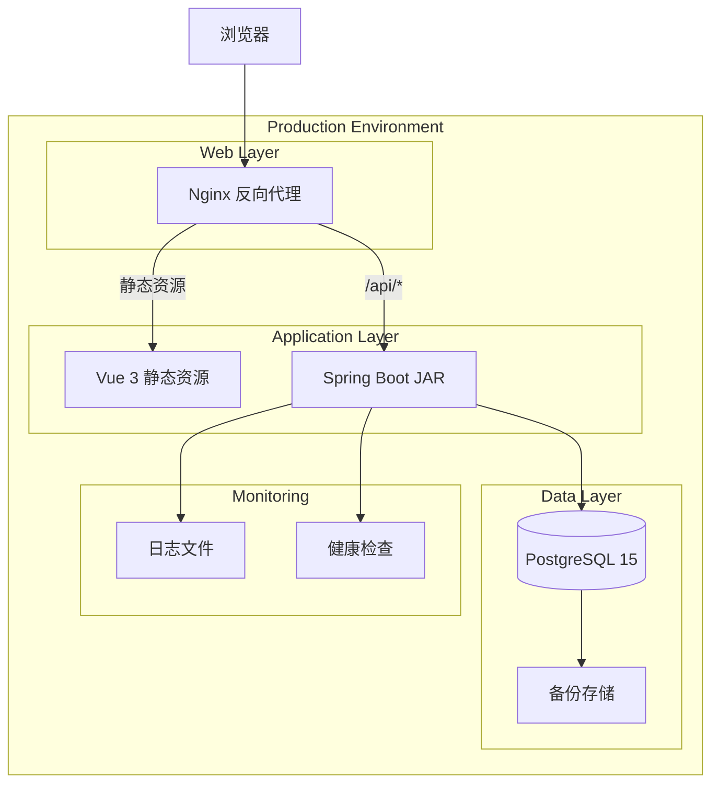
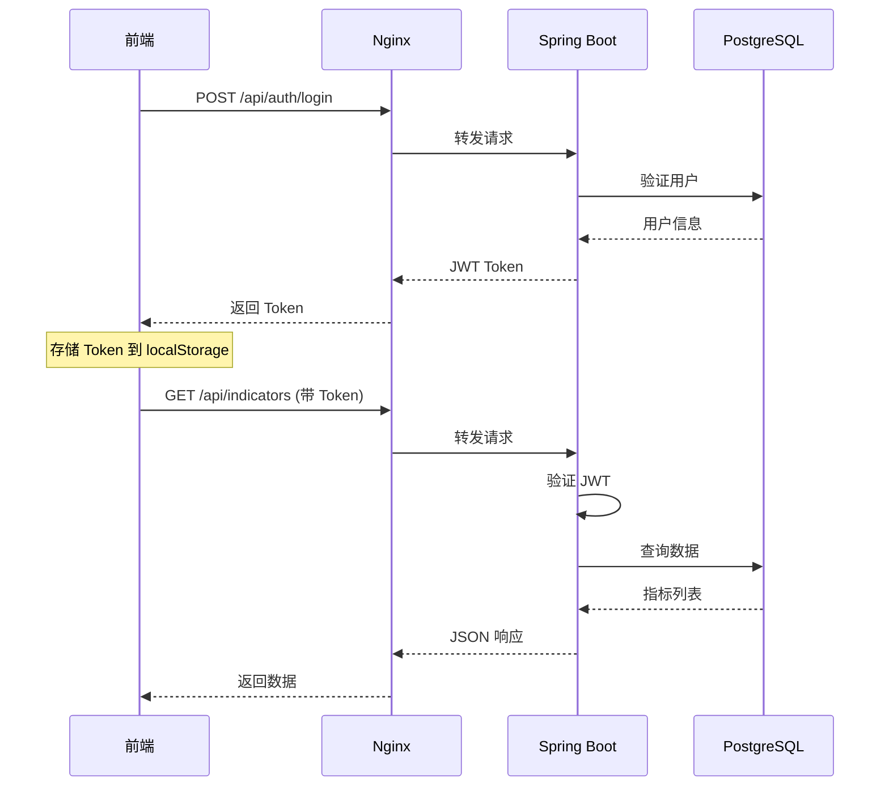
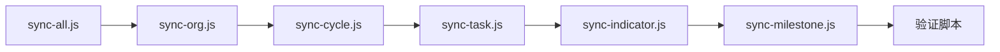

# Design Document: 生产部署与集成

## Overview

本设计文档描述战略指标管理系统（SISM）的生产部署与前后端集成方案。系统采用前后端分离架构：
- **前端**: Vue 3 + TypeScript + Pinia + Element Plus
- **后端**: Spring Boot 3.2 + JPA + PostgreSQL
- **部署**: Nginx 反向代理 + JAR 独立运行

## Architecture



### 部署架构说明

1. **Nginx 反向代理**: 处理 HTTPS 终止、静态资源服务、API 请求转发
2. **前端静态资源**: Vite 构建产物，由 Nginx 直接服务
3. **后端 JAR**: Spring Boot 可执行 JAR，监听 8080 端口
4. **PostgreSQL**: 数据持久化，支持每日备份

## Components and Interfaces

### 1. 前后端 API 接口映射

| 前端 API 调用 | 后端 Controller | 端点 |
|--------------|----------------|------|
| `apiService.get('/auth/login')` | AuthController | POST /api/auth/login |
| `apiService.get('/indicators')` | IndicatorController | GET /api/indicators |
| `apiService.post('/indicators')` | IndicatorController | POST /api/indicators |
| `apiService.get('/milestones')` | MilestoneController | GET /api/milestones |
| `apiService.post('/milestones')` | MilestoneController | POST /api/milestones |
| `apiService.get('/tasks')` | TaskController | GET /api/tasks |
| `apiService.get('/orgs')` | OrgController | GET /api/orgs |
| `apiService.get('/audit-logs')` | AuditLogController | GET /api/audit-logs |

### 2. 认证流程



### 3. 数据同步流程



## Data Models

### 前后端类型对照表

| 前端 TypeScript | 后端 Entity | 数据库表 |
|----------------|-------------|---------|
| `User` | `AppUser` | `app_user` |
| `StrategicTask` | `StrategicTask` | `strategic_task` |
| `StrategicIndicator` | `Indicator` | `indicator` |
| `Milestone` | `Milestone` | `milestone` |
| `ProgressReport` | `ProgressReport` | `progress_report` |
| `AuditLogItem` | `AuditLog` | `audit_log` |

### 关键字段映射

```typescript
// 前端 StrategicIndicator
interface StrategicIndicator {
  id: string                    // → indicator.indicator_id (UUID)
  name: string                  // → indicator.description
  ownerDept?: string            // → indicator.owner_org_id (FK)
  responsibleDept: string       // → indicator.target_org_id (FK)
  parentIndicatorId?: string    // → indicator.parent_indicator_id (FK)
  year?: number                 // → indicator.year
  status: string                // → indicator.status (Enum)
}
```

```java
// 后端 Indicator Entity
@Entity
@Table(name = "indicator")
public class Indicator extends BaseEntity {
    @Id
    @Column(name = "indicator_id")
    private UUID indicatorId;
    
    @Column(name = "description")
    private String description;
    
    @ManyToOne
    @JoinColumn(name = "owner_org_id")
    private Org ownerOrg;
    
    @ManyToOne
    @JoinColumn(name = "target_org_id")
    private Org targetOrg;
    
    @ManyToOne
    @JoinColumn(name = "parent_indicator_id")
    private Indicator parentIndicator;
    
    @Column(name = "year")
    private Integer year;
    
    @Enumerated(EnumType.STRING)
    @Column(name = "status")
    private IndicatorStatus status;
}
```


## Correctness Properties

*A property is a characteristic or behavior that should hold true across all valid executions of a system-essentially, a formal statement about what the system should do. Properties serve as the bridge between human-readable specifications and machine-verifiable correctness guarantees.*

### Property 1: API 路径一致性
*For any* API 端点定义，前端调用路径与后端 Controller 注解路径应完全匹配
**Validates: Requirements 1.1**

### Property 2: 请求体序列化往返
*For any* 前端请求对象，序列化为 JSON 后由后端 DTO 反序列化，再序列化回 JSON 应与原始 JSON 结构等价
**Validates: Requirements 1.2, 1.3**

### Property 3: 字段命名规范一致性
*For any* API 字段名称，应遵循统一的 camelCase 命名规范
**Validates: Requirements 1.4**

### Property 4: Entity-Schema 字段覆盖
*For any* 后端 Entity 类的字段，数据库表中应存在对应的列
**Validates: Requirements 2.1**

### Property 5: 外键关系一致性
*For any* Entity 中的 @ManyToOne 关系，数据库中应存在对应的外键约束
**Validates: Requirements 2.2**

### Property 6: 类型映射兼容性
*For any* Entity 字段的 Java 类型，数据库列类型应与之兼容
**Validates: Requirements 2.3**

### Property 7: 枚举值一致性
*For any* 枚举类型字段，前端枚举值集合应与后端 Enum 定义一致
**Validates: Requirements 2.4**

### Property 8: TypeScript-VO 字段匹配
*For any* 后端 VO 类的字段，前端 TypeScript 接口应包含对应的属性定义
**Validates: Requirements 3.1, 3.2**

### Property 9: Service 方法测试覆盖
*For any* Service 类的公开方法，应存在对应的单元测试
**Validates: Requirements 4.2**

### Property 10: Controller 端点测试覆盖
*For any* Controller 的 API 端点，应存在对应的集成测试
**Validates: Requirements 4.3**

### Property 11: Store Action 测试覆盖
*For any* Pinia Store 的 action 方法，应存在对应的单元测试
**Validates: Requirements 5.2**

### Property 12: 指标数据渲染一致性
*For any* 后端返回的指标数据，前端渲染后显示的关键字段应与原始数据一致
**Validates: Requirements 6.2**

### Property 13: 里程碑更新往返
*For any* 里程碑更新请求，保存后查询返回的数据应与提交的数据一致
**Validates: Requirements 6.3**

### Property 14: 审批状态流转正确性
*For any* 审批操作，状态流转应遵循定义的状态机规则
**Validates: Requirements 6.4**

### Property 15: 错误响应处理一致性
*For any* 后端错误响应，前端应正确解析并显示对应的错误信息
**Validates: Requirements 6.5**

### Property 16: 数据同步记录数一致性
*For any* 同步操作完成后，数据库记录数应与前端源数据数量一致
**Validates: Requirements 9.2**

### Property 17: 外键关联有效性
*For any* 同步后的数据记录，所有外键引用应指向有效的记录
**Validates: Requirements 9.3**

### Property 18: 同步幂等性
*For any* 同步操作，多次执行应产生相同的最终状态，不产生重复数据
**Validates: Requirements 9.4**

### Property 19: API 响应时间约束
*For any* 指标列表查询请求，响应时间应小于 500ms
**Validates: Requirements 11.2**

### Property 20: 数据更新响应时间约束
*For any* 数据更新请求，处理时间应小于 1000ms
**Validates: Requirements 11.3**

### Property 21: 权限验证正确性
*For any* 用户和资源组合，系统应正确验证用户是否具有访问权限
**Validates: Requirements 12.3**

### Property 22: 越权访问拒绝
*For any* 越权访问尝试，系统应返回 403 状态码并记录审计日志
**Validates: Requirements 12.4**

### Property 23: 敏感接口认证要求
*For any* 敏感 API 端点，未认证请求应返回 401 状态码
**Validates: Requirements 12.5**

### Property 24: 密码加密存储
*For any* 用户密码，存储格式应符合 BCrypt 加密格式
**Validates: Requirements 12.7**

## Error Handling

### 前端错误处理策略

```typescript
// API 错误处理层级
1. 网络错误 → 自动降级到模拟数据 + 控制台警告
2. 401 未授权 → 清除 Token + 重定向登录页
3. 403 禁止访问 → 显示权限不足提示
4. 404 资源不存在 → 显示友好的空状态
5. 500 服务器错误 → 显示错误提示 + 记录日志
```

### 后端错误处理策略

```java
// 全局异常处理
@RestControllerAdvice
public class GlobalExceptionHandler {
    // 业务异常 → 400 Bad Request + 业务错误码
    // 认证异常 → 401 Unauthorized
    // 授权异常 → 403 Forbidden
    // 资源不存在 → 404 Not Found
    // 数据验证失败 → 422 Unprocessable Entity
    // 服务器内部错误 → 500 Internal Server Error
}
```

### 数据同步错误处理

```javascript
// 同步脚本错误处理
1. 数据库连接失败 → 输出错误信息 + 退出
2. 单条记录插入失败 → 记录错误 + 继续下一条
3. 批量操作失败 → 回滚当前批次 + 输出失败记录
4. 外键约束违反 → 检查依赖数据 + 提示修复方案
```

## Testing Strategy

### 测试框架选择

| 层级 | 前端 | 后端 |
|-----|------|------|
| 单元测试 | Vitest | JUnit 5 |
| 属性测试 | fast-check | jqwik |
| 集成测试 | Vitest + MSW | Spring Boot Test |
| E2E 测试 | Playwright (可选) | - |

### 测试目录结构

```
# 前端测试
strategic-task-management/
├── src/
│   ├── api/
│   │   └── fallback.property.test.ts    # API 降级属性测试
│   ├── config/
│   │   └── departments.spec.ts          # 部门配置测试
│   ├── stores/
│   │   └── dashboard.spec.ts            # Store 单元测试
│   └── utils/
│       └── styleHelpers.property.test.ts # 工具函数属性测试

# 后端测试
sism-backend/
├── src/test/java/com/sism/
│   ├── controller/                      # Controller 集成测试
│   ├── service/                         # Service 单元测试
│   └── property/                        # jqwik 属性测试
```

### 属性测试示例

```typescript
// 前端: 数据同步幂等性测试 (fast-check)
import fc from 'fast-check'

describe('Sync Idempotency', () => {
  it('should produce same result when sync executed multiple times', () => {
    fc.assert(
      fc.property(fc.array(fc.record({
        id: fc.uuid(),
        name: fc.string(),
        status: fc.constantFrom('active', 'draft', 'archived')
      })), (indicators) => {
        const result1 = syncIndicators(indicators)
        const result2 = syncIndicators(indicators)
        return deepEqual(result1, result2)
      })
    )
  })
})
```

```java
// 后端: 审批状态流转属性测试 (jqwik)
@Property(tries = 100)
void approvalStatusTransitionShouldFollowStateMachine(
    @ForAll("validApprovalStatus") ApprovalStatus currentStatus,
    @ForAll("validApprovalAction") ApprovalAction action
) {
    ApprovalStatus newStatus = approvalService.transition(currentStatus, action);
    assertThat(isValidTransition(currentStatus, action, newStatus)).isTrue();
}
```

### 测试覆盖要求

- 单元测试覆盖率: ≥ 70%
- 属性测试: 每个核心业务规则至少 1 个属性测试
- 集成测试: 每个 API 端点至少 1 个测试用例

## Deployment Configuration

### Nginx 配置示例

```nginx
server {
    listen 443 ssl http2;
    server_name sism.example.com;
    
    ssl_certificate /etc/nginx/ssl/sism.crt;
    ssl_certificate_key /etc/nginx/ssl/sism.key;
    
    # 安全头
    add_header X-Frame-Options "SAMEORIGIN" always;
    add_header X-Content-Type-Options "nosniff" always;
    add_header X-XSS-Protection "1; mode=block" always;
    
    # 前端静态资源
    location / {
        root /var/www/sism/dist;
        try_files $uri $uri/ /index.html;
        expires 1d;
    }
    
    # API 代理
    location /api/ {
        proxy_pass http://localhost:8080;
        proxy_set_header Host $host;
        proxy_set_header X-Real-IP $remote_addr;
        proxy_set_header X-Forwarded-For $proxy_add_x_forwarded_for;
        proxy_set_header X-Forwarded-Proto $scheme;
    }
    
    # 健康检查
    location /health {
        proxy_pass http://localhost:8080/actuator/health;
    }
}
```

### 后端生产配置 (application-prod.yml)

```yaml
spring:
  datasource:
    url: jdbc:postgresql://${DB_HOST}:${DB_PORT}/${DB_NAME}
    username: ${DB_USER}
    password: ${DB_PASSWORD}
  jpa:
    hibernate:
      ddl-auto: validate
    show-sql: false

logging:
  level:
    root: INFO
    com.sism: INFO
  file:
    name: /var/log/sism/application.log
  logback:
    rollingpolicy:
      max-file-size: 100MB
      max-history: 30

management:
  endpoints:
    web:
      exposure:
        include: health,info,metrics
  endpoint:
    health:
      show-details: when_authorized
```

### 数据库备份脚本

```bash
#!/bin/bash
# /opt/sism/scripts/backup.sh

BACKUP_DIR="/var/backups/sism"
DATE=$(date +%Y%m%d_%H%M%S)
DB_NAME="sism"

# 创建备份
pg_dump -U sism_user -h localhost $DB_NAME | gzip > "$BACKUP_DIR/sism_$DATE.sql.gz"

# 清理 30 天前的备份
find $BACKUP_DIR -name "sism_*.sql.gz" -mtime +30 -delete

# 记录日志
echo "$(date): Backup completed - sism_$DATE.sql.gz" >> /var/log/sism/backup.log
```

### CI/CD 流水线 (GitHub Actions 示例)

```yaml
name: SISM CI/CD

on:
  push:
    branches: [main]
  pull_request:
    branches: [main]

jobs:
  backend-test:
    runs-on: ubuntu-latest
    steps:
      - uses: actions/checkout@v4
      - uses: actions/setup-java@v4
        with:
          java-version: '17'
          distribution: 'temurin'
      - name: Run tests
        run: cd sism-backend && mvn test
      - name: Build JAR
        run: cd sism-backend && mvn package -DskipTests

  frontend-test:
    runs-on: ubuntu-latest
    steps:
      - uses: actions/checkout@v4
      - uses: actions/setup-node@v4
        with:
          node-version: '18'
      - name: Install dependencies
        run: cd strategic-task-management && npm ci
      - name: Type check
        run: cd strategic-task-management && npm run type-check
      - name: Run tests
        run: cd strategic-task-management && npm run test
      - name: Build
        run: cd strategic-task-management && npm run build

  deploy:
    needs: [backend-test, frontend-test]
    if: github.ref == 'refs/heads/main'
    runs-on: ubuntu-latest
    steps:
      - name: Deploy to production
        run: echo "Deploy to production server"
        # 实际部署步骤根据服务器配置添加
```

