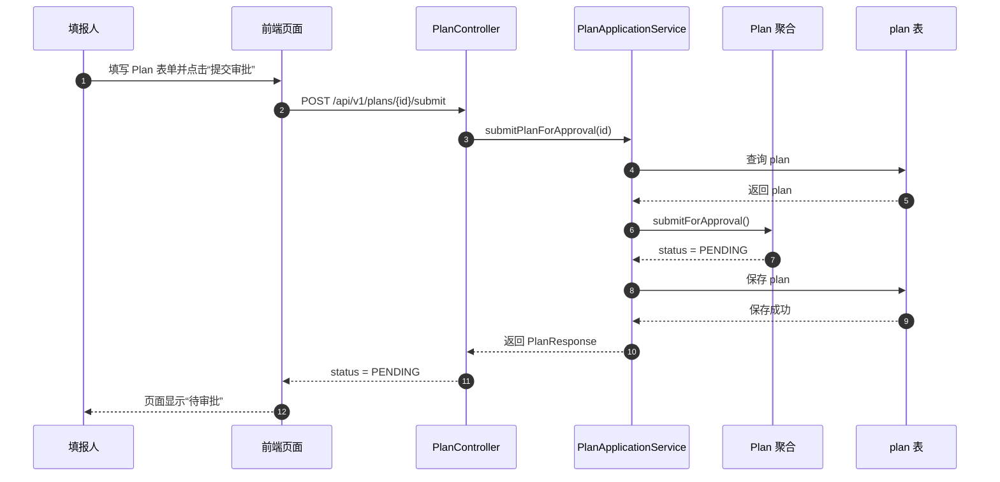
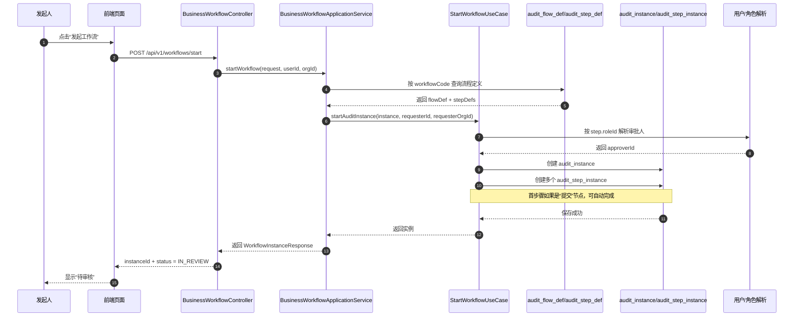
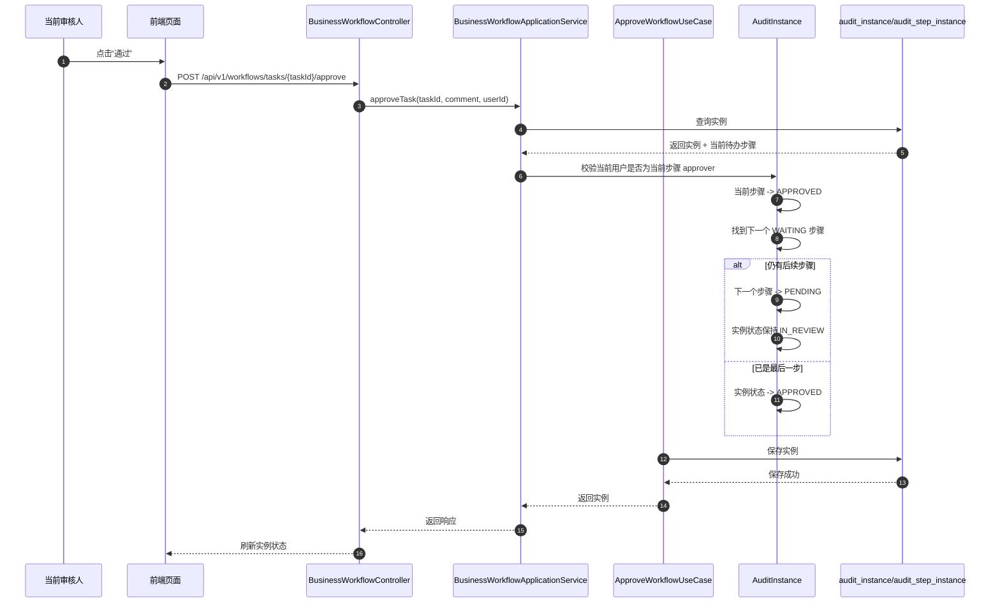
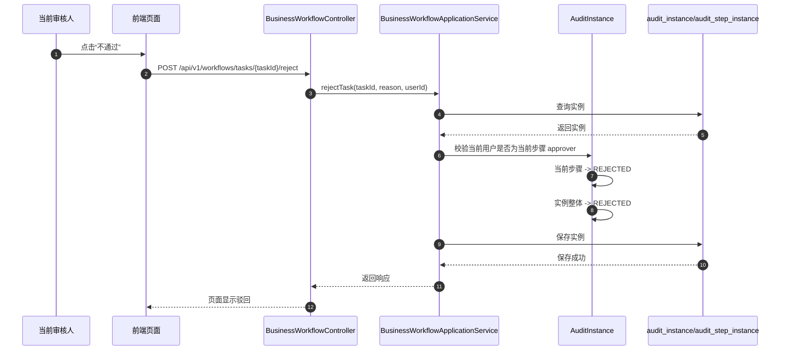
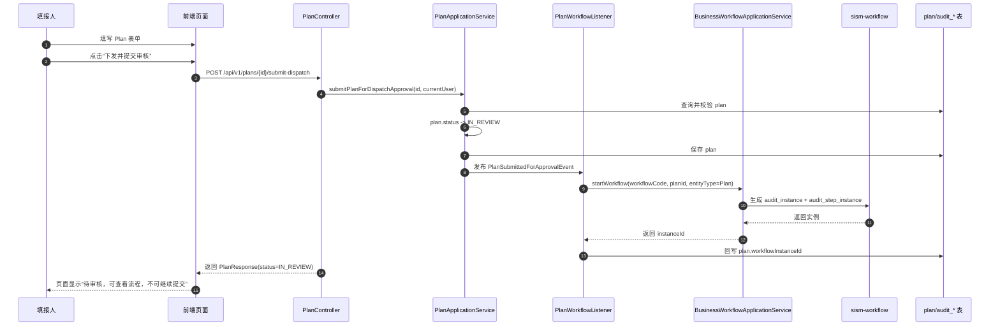
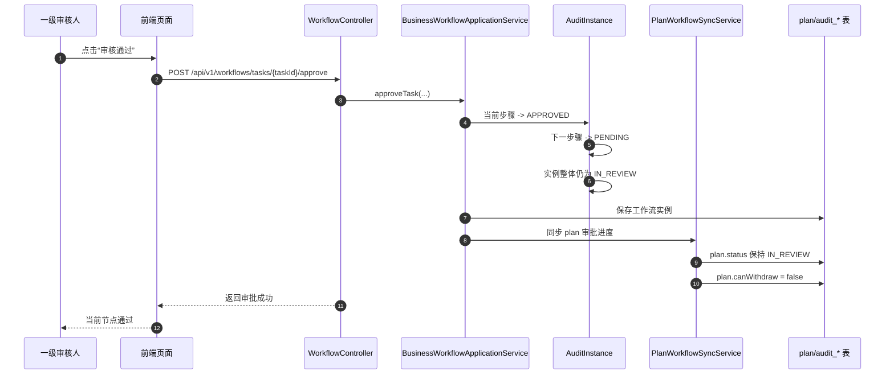
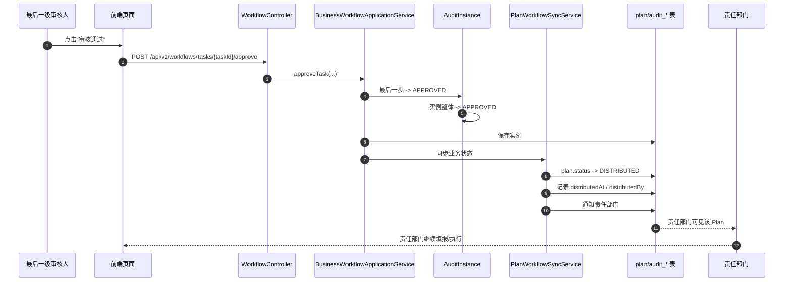
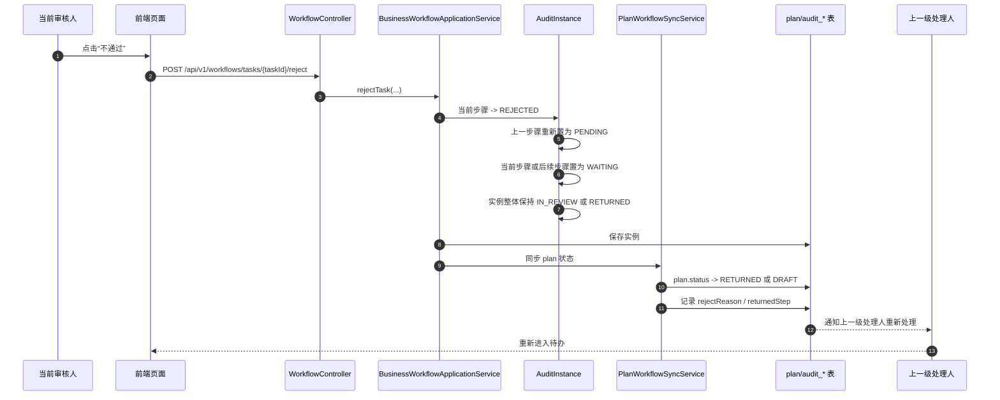

# Plan 审批工作流时序图与改造方案

更新时间：2026-03-19

本文档用于把当前仓库中的“实际实现方式”和你们想要的“Plan 填报-审核-下发-继续填报”目标流程对齐。

重点回答三个问题：

- 当前系统实际上是怎么跑的
- 目标流程应该怎么跑
- 从当前实现改到目标实现，需要改哪些模块

---

## 1. 参与模块与职责

当前链路涉及四类对象：

- 前端页面
  - 用户填写 Plan 表单
  - 点击“下发并提交审核”或“审核通过/不通过”
- `sism-strategy`
  - 持有 `plan` 业务聚合
  - 当前只实现了 `DRAFT -> PENDING -> DISTRIBUTED` 三态业务流转
- `sism-workflow`
  - 持有审批流程模板和审批实例
  - 负责按步骤推进审批、查询待办、记录历史
- `sism-iam`
  - 提供用户和角色数据
  - 当前审批人解析依赖角色找人，但解析规则仍较简化

数据库中的核心表：

- `audit_flow_def`
  - 流程模板定义
- `audit_step_def`
  - 模板步骤定义
- `audit_instance`
  - 运行中的审批实例
- `audit_step_instance`
  - 审批实例中的步骤实例

---

## 2. 当前实际实现

### 2.1 当前 Plan 业务的真实状态

当前 `plan` 还没有完整接入 `sism-workflow`。

它目前主要还是 `sism-strategy` 自己在推进状态：

- 草稿：`DRAFT`
- 待审批：`PENDING`
- 已下发：`DISTRIBUTED`

对应代码：

- [`Plan.java`](/Users/blackevil/Documents/前端架构测试/sism-backend/sism-strategy/src/main/java/com/sism/strategy/domain/plan/Plan.java#L94)
- [`PlanApplicationService.java`](/Users/blackevil/Documents/前端架构测试/sism-backend/sism-strategy/src/main/java/com/sism/strategy/application/PlanApplicationService.java#L134)
- [`PlanController.java`](/Users/blackevil/Documents/前端架构测试/sism-backend/sism-strategy/src/main/java/com/sism/strategy/interfaces/rest/PlanController.java#L98)

也就是说：

- 前端点 `POST /api/v1/plans/{id}/submit`
- 后端只是把 `plan.status` 从 `DRAFT` 改成 `PENDING`
- 没有自动创建 `audit_instance`
- 没有自动生成审批步骤实例
- 没有把审批过程真正交给 `sism-workflow`

### 2.2 当前 workflow 模块的真实能力

虽然 `plan` 没完全接进去，但 `sism-workflow` 本身已经具备通用审批引擎能力：

- 按 `workflowCode` 找流程模板
- 按 `audit_step_def` 生成步骤实例
- 按步骤顺序审批
- 当前步骤通过后推进到下一步骤
- 最后一步通过后实例整体变成 `APPROVED`
- 驳回时实例整体直接变成 `REJECTED`

对应代码：

- [`BusinessWorkflowApplicationService.java`](/Users/blackevil/Documents/前端架构测试/sism-backend/sism-workflow/src/main/java/com/sism/workflow/application/BusinessWorkflowApplicationService.java#L42)
- [`StartWorkflowUseCase.java`](/Users/blackevil/Documents/前端架构测试/sism-backend/sism-workflow/src/main/java/com/sism/workflow/application/runtime/StartWorkflowUseCase.java)
- [`AuditInstance.java`](/Users/blackevil/Documents/前端架构测试/sism-backend/sism-workflow/src/main/java/com/sism/workflow/domain/runtime/model/AuditInstance.java#L111)
- [`StepInstanceFactory.java`](/Users/blackevil/Documents/前端架构测试/sism-backend/sism-workflow/src/main/java/com/sism/workflow/application/support/StepInstanceFactory.java#L22)

### 2.3 当前审批人解析方式

这里要特别区分“当前代码实际怎么做”和“目标业务应该怎么做”。

当前代码实际做法是后端自动选人，不是前端手工选人：

- 每个步骤定义 `audit_step_def.role_id`
- 启动实例时后端按 `role_id` 去查用户
- 优先选与发起人同组织的用户
- 找不到就取该角色下最小 `id` 的用户
- 如果步骤没配 `role_id`，就退化成发起人自己

对应代码：

- [`ApproverResolver.java`](/Users/blackevil/Documents/前端架构测试/sism-backend/sism-workflow/src/main/java/com/sism/workflow/application/support/ApproverResolver.java#L19)

这只是当前仓库里的临时解析逻辑，不适合作为你们最终业务方案。

按你的业务要求，目标方案不应该是“后端自动挑最小 ID 的人”，而应该是：

- 流程模板定义“这个步骤允许由哪类角色/哪类岗位的人来审批”
- 前端在发起或配置流程时，展示该步骤的候选人员列表
- 由用户在页面上显式选择具体审核人
- 后端只负责校验“所选人员是否属于该步骤允许的角色/组织范围”，然后把这个人落到步骤实例里

也就是说：

- 当前实现：后端自动解析并默认挑一个人
- 目标实现：前端选择具体人，后端负责校验和保存

这个差异很关键，后续改造时应以“前端选择审批人”作为目标口径，而不是延续当前自动选人策略。

---

## 3. 当前实现的时序图

### 3.1 当前 Plan 提交时序图

这个流程里没有 `sism-workflow` 参与。

### 3.2 当前 workflow 发起通用审批时序图

### 3.3 当前 workflow 审批通过时序图

说明：

- 第一个审核人通过后，整体实例仍是 `IN_REVIEW`
- 这和你想要的“整体仍显示待审核”是吻合的

### 3.4 当前 workflow 驳回时序图

说明：

- 当前不是“逐级打回上一节点”
- 当前是一票驳回，整个实例直接结束

---

## 4. 目标流程时序图

以下是按你的目标整理后的理想流程。

### 4.1 目标：填报人下发并提交审核

### 4.2 目标：第一位审核人通过，但整体仍待审核且不可撤回

### 4.3 目标：全部审核人通过后，Plan 进入下发阶段

### 4.4 目标：某一级审核人不通过，逐级打回上一节点

---

## 5. 当前实现与目标流程的差距

### 5.1 已经有的能力

- 工作流模板和步骤模板已经支持数据库驱动
- 审批实例和步骤实例已经支持顺序推进
- 审批人已经支持按步骤角色动态解析
- 第一个审核人通过后整体仍保持 `IN_REVIEW`
- 可以查询“我的待办”和实例详情

### 5.2 尚未满足的能力

- `plan` 没有真正接入 workflow 启动链路
- `plan` 没有保存 `workflowInstanceId`
- 提交 plan 不会自动创建审批实例
- 撤回没有“首个审核后不可撤回”的限制
- 驳回不是逐级退回，而是整个实例直接 `REJECTED`
- 下发完成后没有统一的业务同步服务把 plan 推到“责任部门可继续填报”
- 转办和加签还是占位实现
- 还没有清晰的“审批进度字段”和“前端按钮可用性规则”

---

## 6. 改造建议

下面按“最小闭环优先”的原则来拆。

### 6.1 第一阶段：先把 Plan 真正接入 workflow

目标：

- 点击“下发并提交审核”时，不再只改 `plan.status`
- 同时真正启动 `audit_instance`

建议改造：

- 在 `plan` 表增加 `workflow_instance_id`
- 在 `plan` 表增加更明确的审核态字段或复用 `status`
- 新增 `PlanSubmittedForApprovalEvent`
- 在 `sism-workflow` 新增 `PlanWorkflowEventListener`
- 提交 plan 时发布事件，由监听器调用 `BusinessWorkflowApplicationService.startWorkflow(...)`
- 前端提交时一并传入每个审批步骤选中的审核人
- 后端启动实例时不再自动挑“最小 ID”，而是优先使用前端显式选择的审核人

建议新增状态：

- `DRAFT`
- `IN_REVIEW`
- `DISTRIBUTED`
- `RETURNED`

这样会比当前只用 `PENDING` 更贴近审批语义。

### 6.2 第二阶段：补齐撤回规则

目标：

- 发起后、尚无人处理时可撤回
- 只要任一审核节点已处理，就不可撤回

建议改造：

- 在 `AuditInstance.cancel()` 前增加校验
- 如果存在任一 `audit_step_instance.status in (APPROVED, REJECTED)`，禁止撤回
- 前端详情接口返回 `canWithdraw`

前端按钮规则建议：

- `canWithdraw = true`
  - 实例 `IN_REVIEW`
  - 当前无任何已处理步骤
  - 当前用户是发起人
- `canWithdraw = false`
  - 任一审批人已处理
  - 或实例已结束

### 6.3 第三阶段：把“驳回即结束”改成“逐级打回”

这是最关键的业务改造点。

当前 `AuditInstance.reject()` 逻辑是：

- 当前节点 `REJECTED`
- 实例整体 `REJECTED`

要改成：

- 找到当前 `PENDING` 步骤
- 找到上一个已通过步骤
- 当前步骤记为 `REJECTED`
- 上一个步骤重新置为 `PENDING`
- 当前步骤之后的节点全部恢复为 `WAITING`
- 实例整体保持 `IN_REVIEW` 或改为 `RETURNED`

建议新增实例级状态：

- `IN_REVIEW`
- `RETURNED`
- `APPROVED`
- `WITHDRAWN`

建议保留步骤级状态：

- `PENDING`
- `WAITING`
- `APPROVED`
- `REJECTED`
- 可选新增 `RETURNED`

### 6.4 第四阶段：补齐“最终通过后进入下发阶段”的业务同步

目标：

- 最后一个审核人通过后
- `workflow` 完成只是中间结果
- 还要同步推动 `plan` 进入真正的“已下发”业务状态

建议改造：

- 新增 `PlanWorkflowSyncService`
- 监听 workflow 完成事件
- 若 workflow 对应实体是 `Plan`
  - `APPROVED` 时调用 plan 下发逻辑
  - `RETURNED/REJECTED` 时回退 plan
- 补充责任部门通知和可见性刷新

这里建议不要让前端自己判断“现在是不是下发成功”，而是以后端同步后的 `plan.status` 为准。

### 6.5 第五阶段：补齐前端显示模型

前端页面至少要拿到这些信息：

- `plan.status`
- `workflowInstanceId`
- 当前审批节点名
- 当前审批人
- 审批历史
- 是否可撤回
- 是否可审核
- 是否可重新编辑
- 打回原因
- 每个审批步骤的候选人列表
- 每个审批步骤当前已选审核人

发起页面还需要新增一块能力：

- 在“下发并提交审核”前，允许用户为每个审批步骤选择对应审核人
- 如果某一步是固定系统节点，例如“提交节点”，则不需要选择
- 如果某一步允许多人候选，则前端展示候选名单供选择
- 后端提交时校验候选人与步骤配置是否匹配

建议由后端新增统一详情 DTO，而不是让前端自己拼多个接口。

建议前端按钮规则：

- 填报人看到
  - `保存`
  - `下发并提交审核`
  - `撤回`
  - `查看审批进度`
- 审核人看到
  - `通过`
  - `不通过`
  - `查看表单`
  - `查看审批历史`
- 责任部门看到
  - 审批全部通过后才可见
  - 可继续填报或执行

---

## 7. 建议的数据模型补充

建议 `plan` 侧补充以下字段：

- `workflow_instance_id`
- `submitted_by`
- `submitted_at`
- `distributed_by`
- `distributed_at`
- `current_audit_step_name`
- `current_audit_step_index`
- `last_reject_reason`
- `last_returned_by`
- `last_returned_at`

如果不想把运行时审批细节冗余到 `plan`，至少也建议保留：

- `workflow_instance_id`
- `submitted_at`
- `distributed_at`
- `last_reject_reason`

---

## 8. 推荐落地顺序

### P1：先闭环最小业务主链路

- Plan 提交时自动启动 workflow
- Plan 保存 `workflow_instance_id`
- 审批全部通过后自动下发
- 前端能看到审批进度和当前节点

### P2：补齐规则型能力

- 首个审核后不可撤回
- 逐级打回上一节点
- 责任部门通知

### P3：补齐增强型能力

- 转办
- 加签
- 多候选审批人
- 会签/或签
- 审批意见模板

---

## 9. 我建议你们采用的最终口径

如果要和产品、前端、后端统一说法，我建议统一成下面这套：

1. Plan 提交审核后，业务状态进入 `IN_REVIEW`。
2. 工作流实例按数据库配置的流程和步骤生成。
3. 审批人不是写死在用户角色中，而是由流程步骤配置角色，再在运行时解析到具体用户。
4. 某一级审核人通过后，只推进到下一审核节点，Plan 整体仍然是 `IN_REVIEW`。
5. 一旦任何一级已经处理，发起人不可撤回。
6. 任一级不通过，不是直接终止，而是逐级打回上一节点重新处理。
7. 全部审核通过后，Plan 才进入 `DISTRIBUTED`，责任部门开始可见并继续填报。

---

## 10. 下一步可直接落地的开发任务

如果按开发任务拆，我建议直接建下面 6 个任务：

1. `plan` 接入 workflow 启动链路
2. `plan` 与 `workflow instance` 关系字段改造
3. workflow 撤回规则改造
4. workflow 驳回回退机制改造
5. workflow 完成后 plan 业务同步改造
6. 前端 Plan 详情页审批态展示与按钮权限改造

这 6 个任务里，前 2 个做完就能先跑通“提交后进入真实审批实例”的主链路。
